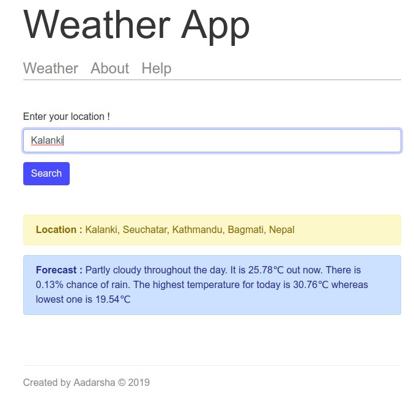
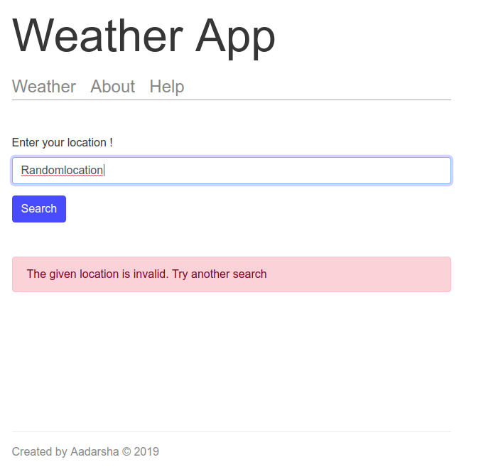

# WeatherApplication

:sunny: :cloud: :umbrella:

Weather app is web based application that helps to search and display the weather in the different parts of the world.


**Technology Used :** :computer:

- Node JS 10.15.3

- npm 6.4.1

- ES6

- API from http://darksky.net and https://www.mapbox.com/

---


I haved deployed this app so you can check here.

https://aadarsha-weather-app.herokuapp.com/

---


**How to Use App** :syringe:


 Enter the location you want to search and click on search.

- If the result is found the following will be displayed : 




- Else the following error message will be displayed :




---
**You can run the app in the local environment.** :running:

Make sure you have Node and npm installed. 

Open in terminal in Mac or Linux or bash shell in Windows and run the following command.

1. Clone the repo first:

    https://github.com/adarshaacharya/WeatherWebsite.git


2. Go to that folder and run the given command : 
    ```
    npm start
    ```
3. Open the browser and go to  http://localhost:3000/

---

*Feel free to contribute and help improve the project!*